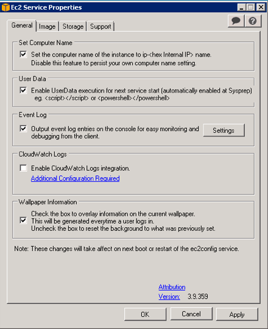
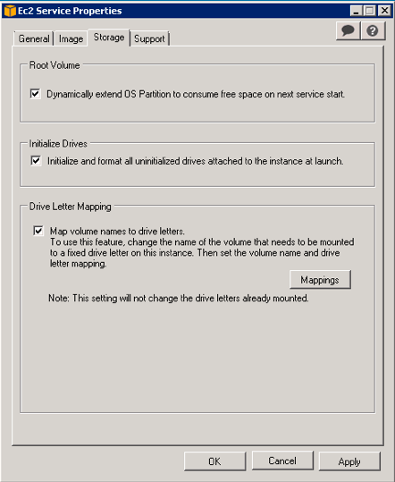

# Building an MzConverter base AMI	
Very crude notes; in progress to boot.  You have to know what you're doing, or at least fake it better than I am.

Fire up a Windows AMI based on the "Microsoft Windows Server 2008 R2 Base" AMI, available from Amazon.  The AMI id changes monthly, following Microsoft's patch tuesdays.

Run chef-client on the instance, using the bootstrap\_runlist in the mzconvert role.  This will invoke the windows\_base role, which installs chocolatey, etc. all the way through installing XCalibur. 

You ***may*** need to uninstall and reinstall Thermo Foundation and Thermo XCalibur.  I'm not sure.  I don't think I had to, last time I fired up an instance using Chef.

Install the Shimadzu lab solutions product, available in the ib-installers bucket.

Contact Shimadzu and have them license the LabSolutions product.  Run labsolutions once, and log in as "admin," no password.  Close labsolutions.

Uninstall chef-client.

Remove the c:\chef directory and all of its contents.

Remove the c:\cfn directory and all of its contents.

Remove the c:\packages\shimadzu and c:\packages\xcalibur directories, and all of their contents.

Empty the recycle bin.

Run ec2configservicesettings.exe.  Follow the screenshots, below, and choose to shut down WITH sysprep.

The instance will shut down.  Open the EC2 management console, right click on the instance, choose "image," then choose "create image."

Once the image is created, right-click on the image and modify its permissions. Share the image with the other account (in this case, I'm sharing from ibdev to production).

Copy the image to the other AWS regions in the US.
